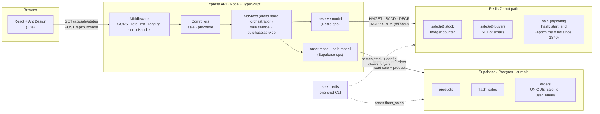
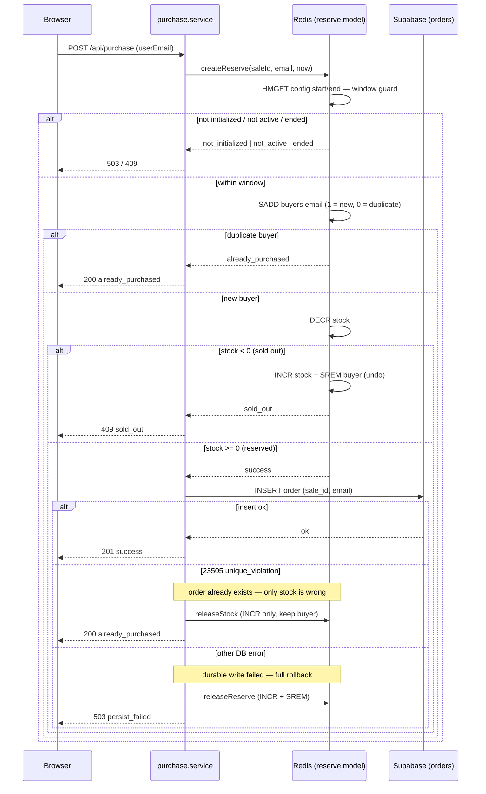

# Flash Sale

> High-traffic, limited-stock, single-product flash sale with a configurable time
> window. The system enforces **limited stock** (no overselling), **one item per
> user**, and a **fixed sale window** under heavy concurrency, without losing data.

**Architecture in one line:** React → Express API → **Redis** (atomic reserve, hot
path) → **Supabase / Postgres** (durable orders + `UNIQUE` backstop).

## Tech Stack

- **Backend:** Node 20+ · Express · TypeScript
- **Hot path:** Redis 7 (ioredis)
- **Durable store:** Supabase / Postgres (@supabase/supabase-js)
- **Frontend:** React 18 · Vite 5 · Ant Design 6
- **Tests:** Vitest · supertest · autocannon (load)

---

## System Architecture



### Components & request flow

| Layer | Responsibility |
|-------|----------------|
| **React + Ant Design (Vite)** | Renders sale status + remaining stock, collects the buyer email, fires `POST /api/purchase`. Mirrors the server's email validation for fast feedback. |
| **Express middleware** | CORS, per-IP rate limiting (`/api` only; `/health` exempt), request logging, and a central `errorHandler` that emits the `{ error: { code, message } }` envelope (a consistent response shape). |
| **Controllers** | Thin HTTP glue: validate input, call a service, map the result to a status code (`success` 201, `already_purchased` 200, the 409s, etc.). |
| **Services** | **Cross-store orchestration** (coordinates both stores — Redis + Postgres). `purchase.service` coordinates the Redis reserve, the durable write, and compensation; `sale.service` computes window state + remaining stock. |
| **Models** | **Single-store data access.** `reserve.model` holds *all* Redis ops; `order.model` / `sale.model` hold all Supabase ops. |
| **Redis 7** | The hot path (the code that runs on every purchase request). Atomic reserve via `SADD` (per-user dedup — one order per user) + `DECR` (stock claim). Source of truth for "is the sale open" and "how many are left". |
| **Supabase / Postgres** | Durable order records + the `UNIQUE (sale_id, user_email)` backstop (a safety net at the database level). Source of truth for audit. |
| **`seed:redis`** | One-shot CLI run after the DB seed — reads the sale row and primes Redis (stock + window config, buyers cleared). The server does **not** warm Redis at boot. |

---

## The critical path: concurrency control

The purchase reserve uses **plain atomic Redis commands**. Each command does the work
*and* tells us the result in one step, so that single step decides the outcome. With
no gap between checking and acting, two requests can't slip in and clash.



**Why this works under concurrency:**

- `SADD buyers <email>` returns **1** for a new buyer and **0** for a duplicate —
  atomic per-user dedup (`already_purchased`) with no separate read.
- `DECR stock` atomically claims a unit *and* returns the new count. If it goes
  **< 0**, the unit was over-claimed, so we undo (`INCR` + `SREM`) and return
  `sold_out`. The counter never lets more than `N` buyers past, so **no
  overselling**, and the `DECR` value also encodes buyer ordering.
- The alternative — count buyers with `SCARD` and ask "am I within the first N?" —
  would *read* the count, then *decide* in a separate step. Under load, two requests
  can both read `N-1` and both think a unit is free, so both proceed and oversell.
  Letting `DECR` return the new count folds the claim and the decision into one
  atomic command, so there's no gap for a second request to slip through.

---

## Design choices & trade-offs

### Two stores (Redis hot path + Postgres durable record)

Redis owns the **live reserve**. It runs one command at a time and finishes each one
fully before starting the next, so it settles the race without a lock and without a
trip to the database. Postgres owns the **durable record**, plus a
`UNIQUE (sale_id, user_email)` rule that blocks a second order for the same email as a
separate, independent safety net. The downside is two places that each hold "the
truth," which must be kept in agreement (see below).

### Compensate & reject (reconciliation — keeping the two stores in agreement)

Once Redis reserves a unit, the next step is saving the order to Postgres. If that
save fails, we **compensate** — undo the Redis reserve — so the system is never left
**half-done**: a purchase either fully goes through (reserved *and* saved) or is
rolled all the way back:

| DB outcome | Meaning | Compensation | Response |
|------------|---------|--------------|----------|
| `23505` unique_violation | Request slipped past the Redis dedup but the order already exists | `releaseStock` — `INCR` stock, **keep** the buyer flag | `200 already_purchased` |
| any other error | Durable write genuinely failed | `releaseReserve` — `INCR` stock **and** `SREM` buyer (full rollback) | `503 persist_failed` |

This keeps the Redis stock counter in step with the number of saved orders. A
background job that retries failed saves later (treating Redis as the source of truth
and catching Postgres up afterward) is the noted future upgrade.

### Seed-once model

The server does **not** prime Redis at boot. `npm run seed:redis` reads the active
sale from Postgres once and sets stock + window + clears buyers. The seed is what
**marks a sale as live** — it's the operational start of the sale: until it runs, the
reserve has no stock or window to check, so an unseeded Redis returns
`not_initialized` → `503`. (The window's `start`/`end` still gate when buyers can
actually purchase; seeding is what makes the sale exist for Redis to gate at all.)
Trade-off: a Redis flush/restart loses state until you re-run the seed (no
auto-rebuild).

### Fail-closed

`redis.ts` uses `maxRetriesPerRequest: 3` — a request retries a few times to ride out
a brief blip, but after those attempts are exhausted the reserve throws and the
service returns `503 unavailable` rather than falling back to a race-prone database path. For
a flash sale, **correctness (no overselling) beats availability**.

### No message queue

The atomic Redis commands handle the concurrent traffic on their own, so adding a
queue would only mean more moving parts without making the guarantees any stronger.
It's noted as a way to scale later — smoothing out bursts of writes and letting the
database save happen separately from the request — rather than something built now.

### Known limitations (accepted for exam scope)

- **Self-declared identity** (no auth): `userEmail` comes from the client. The
  `UNIQUE (sale_id, user_email)` constraint still enforces one-per-email durably.
- **Sale config fixed at boot** (cached in Redis): config edits require a re-seed.
- The API itself **keeps no per-user state in memory** — all shared state lives in
  Redis and Postgres. Because any request can be handled by any instance, you can run
  several copies of the API behind a load balancer and scale out simply by adding more.

---

## API surface

| Endpoint | Purpose |
|----------|---------|
| `GET /health` | `{ status: 'ok' }` — rate-limit exempt, for probes. |
| `GET /api/sale/status` | Sale state, `remainingStock` (live Redis counter; falls back to `totalStock − countOrders` when cold), window times, `soldOut`. |
| `POST /api/purchase` | Body `{ userEmail }` → `{ data: { status } }`. Status→HTTP: `success` 201, `already_purchased` 200, `sold_out` / `not_active` / `ended` 409. |

Responses use `{ data }` on success and `{ error: { code, message } }` on failure.

---

## Getting Started

Run each piece **locally with `npm`** using the steps below. Steps 1–2 (Redis +
database) are shared setup; for a one-command containerized alternative that bundles
the API and frontend too, see [Run with Docker](#run-with-docker-full-stack).

### Prerequisites

- **Node.js 20+**
- **Docker** (for local Redis 7)
- A **Supabase / Postgres** database — a hosted Supabase project or the local Supabase CLI

### 1. Infrastructure — Redis

```bash
# from the repo root
docker compose up -d redis        # Redis 7 on localhost:6379
```

### 2. Database — Supabase / Postgres

Apply the schema, then the seed, to your database (in order):

- `backend/supabase/migrations/tables.sql` — `products`, `flash_sales`, `orders` (+ `UNIQUE (sale_id, user_email)`)
- `backend/supabase/seed.sql` — one product + one **active** sale (id `1111…1111`, stock `100`, window now → +1 day)

Run both in the **hosted Supabase SQL editor** (paste each file), or against a **local Supabase CLI** instance (`supabase start`, then apply the two files).

### 3. Backend API

```bash
cd backend
cp .env.example .env               # then fill in SUPABASE_URL + SUPABASE_SERVICE_ROLE_KEY
npm install
npm run seed:redis                 # one-time: prime Redis from the active sale row
npm run dev                        # http://localhost:3000
```

> **Seed-once model:** run `npm run seed:redis` *after* the DB seed, and again any
> time Redis is flushed/restarted. Until it runs, the API reports the sale as
> `unavailable` and purchases return `503 not_initialized` (by design — see
> [Design choices](#design-choices--trade-offs)).

Production build: `npm run build` (→ `dist/`) then `npm start`.

### 4. Frontend

```bash
cd frontend
cp .env.example .env               # VITE_API_BASE_URL defaults to http://localhost:3000
npm install
npm run dev                        # Vite dev server (prints the URL, usually :5173)
```

Production build: `npm run build` (typecheck + `vite build` → static assets in `dist/`).

---

## Run with Docker (full stack)

The [Getting Started](#getting-started) flow runs the API and frontend with `npm`.
This alternative brings up **the whole stack — Redis, API, and frontend — in
containers** with one command. Handy for a reviewer who just wants it running.

### What runs

| Service | Built from | Host port |
|---------|-----------|-----------|
| `redis` | `redis:7-alpine` | 6379 |
| `backend` | `backend/Dockerfile` (Node, prod deps only) | 3000 |
| `frontend` | `frontend/Dockerfile` (Vite build → nginx) | 8080 |

### Prerequisites

- **Docker** (Compose v2)
- Database applied and seeded — run the two SQL files from
  [Database](#2-database--supabase--postgres) first (Supabase is external, not
  containerized).
- `backend/.env` filled in (same file as local dev). `REDIS_URL` is set for you
  inside Compose, so you can leave it out.

### Steps

```bash
# from the repo root
cp backend/.env.example backend/.env   # then fill in SUPABASE_URL + SUPABASE_SERVICE_ROLE_KEY
docker compose up -d --build           # build + start redis, backend, frontend

# one-time: prime Redis from the active sale row (seed-once model)
docker compose exec backend node dist/scripts/seedRedis.js
```

Then open **http://localhost:8080** (frontend); the API is on
**http://localhost:3000**. Stop and remove the containers with `docker compose down`.

> **Why `node dist/scripts/seedRedis.js` instead of `npm run seed:redis`?** The
> backend image ships production dependencies only (no `tsx`), so the seed runs as
> the compiled script — same script, compiled path.

### Check it's working

```bash
docker compose ps                          # all three "Up"; redis + backend show "(healthy)"
curl http://localhost:3000/health          # backend  -> {"status":"ok"}
curl http://localhost:3000/api/sale/status # backend  -> 200 with remainingStock
curl -I http://localhost:8080              # frontend -> HTTP/1.1 200 (nginx serving the app)
```

In the browser, open **http://localhost:8080** — the page should load and show the
product with its live remaining stock (proving the frontend reached the API).

The service-role key never enters an image: Compose injects `backend/.env` into the
running container at start (`env_file`), and the frontend only receives the public
`VITE_API_BASE_URL` build arg.

---

## Configuration

### Backend — `backend/.env`

| Variable | Required | Default | Purpose |
|----------|----------|---------|---------|
| `SUPABASE_URL` | **yes** | — | Supabase project URL |
| `SUPABASE_SERVICE_ROLE_KEY` | **yes** | — | Service-role key — **server-side only, never expose to the frontend** |
| `SUPABASE_ACCESS_TOKEN` | no | — | Supabase CLI token — only for `npm run gen:types` (type generation); not used at runtime |
| `ACTIVE_SALE_ID` | **yes** | `1111…1111` (in `.env.example`) | The `flash_sales` row to run |
| `PORT` | no | `3000` | API port |
| `REDIS_URL` | no | `redis://localhost:6379` | Redis connection |
| `RATE_LIMIT_WINDOW_MS` | no | `60000` | Rate-limit window (ms) |
| `RATE_LIMIT_MAX` | no | `100` | Max requests per IP per window |

### Frontend — `frontend/.env`

| Variable | Required | Default | Purpose |
|----------|----------|---------|---------|
| `VITE_API_BASE_URL` | no | `http://localhost:3000` | Base URL of the API |

Both `.env` files are gitignored; commit only the `.env.example` templates.

---

## Testing

**Vitest + supertest.** The reserve/concurrency suites run against a **real local
Redis** on an isolated db index (15, flushed per test — your seeded db 0 is never
touched); Supabase is **mocked at the
model layer**, so no live DB is needed.

```bash
cd backend
docker compose up -d redis         # (from repo root) the suite needs Redis running
npm test                           # vitest run — full suite, 4 files
```

What it covers:

- **Unit** — sale-window state boundaries; purchase orchestration (success / `23505` compensation / `persist_failed` rollback / fail-closed).
- **Integration** (real Redis) — `POST /api/purchase` status→HTTP map + window guards; `GET /api/sale/status` live counter + cold fallback.
- **Concurrency proofs** — 50 parallel distinct buyers on stock 5 → exactly **5** succeed; the same email ×30 in parallel → exactly **1** succeeds.

---

## Stress Tests (autocannon)

Load tests that hammer `POST /api/purchase` with many concurrent connections to
prove the flash-sale guarantees hold under load, and to capture throughput +
latency. Built on **autocannon** (a Node load tester) — it's already a dev
dependency, so there's nothing extra to install.

### What it does (30-second version)

autocannon opens `CONNECTIONS` parallel sockets and sends a fixed total of `AMOUNT`
requests as fast as it can, then prints **req/sec** (throughput) and **latency**
percentiles (p50 / p97.5 / p99). Our wrapper (`harness.ts`) adds the business view:
how many requests got `201` success vs `409` sold_out, and a PASS/FAIL on the rule.

Two scenarios, each proving exactly one thing:

| Command | Scenario | Expected result (with `AMOUNT=2000`) |
|---------|----------|--------------------------------------|
| `npm run stress:oversell` | distinct buyers race for limited stock | `success = STOCK`, `sold_out = AMOUNT − STOCK` |
| `npm run stress:user` | one buyer spams in parallel | `success = 1`, `already_purchased = AMOUNT − 1` |

PASS/FAIL: `stress:oversell` fails if successes exceed `STOCK` (oversold); `stress:user`
fails if more than one success. Both fail on any `5xx`.

---

### How to run it

You'll use **two terminals**: Terminal 1 runs the server and stays open the whole
time; Terminal 2 is where you run the test commands.

#### Terminal 1 — start Redis + the server (leave this running)

```bash
# from the repo root: start Redis in the background
docker compose up -d redis

# from backend/: start the API with the rate limiter raised
cd backend
npm run dev:stress
```

Leave this terminal open — the server has to keep running while you test.

> **Why `dev:stress` and not `dev`?** The `/api` routes have a per-IP rate limit
> (default 100 req / 60s). A load test all comes from one IP, so with plain `dev`
> you'd just measure `429`s. `dev:stress` is identical to `dev` but raises
> `RATE_LIMIT_MAX` so requests reach the real purchase path. If you forget, you'll
> see a flood of `rate_limited (429)` in the output and a warning.

#### Terminal 2 — run a scenario

Open a **second terminal** (the first one is busy running the server):

```bash
cd backend

# one buyer spamming in parallel → exactly one wins
npm run stress:user

# distinct buyers racing for the stock → only STOCK win
STOCK=100 npm run stress:oversell
```

#### Terminal 2 — clean up when you're done

```bash
npm run stress:clean
```

This deletes the throwaway `@loadtest.dev` order rows from Supabase (a successful
purchase writes a real order row) and clears the sale's Redis keys, **then re-seeds
Redis** so the sale is back to full stock and ready for the next run.

---

### Reading the output

Each run prints, top to bottom:

- **autocannon table** — `Req/Sec` is throughput; the `Latency` rows give p50 /
  p97.5 / p99 (your tail latency).
- **Purchase outcomes** — exact counts of `201` / `200` / `409` / `429` / `5xx`.
- **PASS / FAIL** — the assertion, with a non-zero exit code on failure (so it can
  gate CI).

### Varying the load

Override these with environment variables on the `npm run` command:

| Var | Default | Meaning |
|-----|---------|---------|
| `AMOUNT` | 2000 | total requests to send |
| `CONNECTIONS` | 50 | parallel connections (≈ concurrent users) |
| `STOCK` | 100 | success ceiling for no-oversell (match your seeded stock) |
| `BASE_URL` | `http://localhost:3000` | target server |

```bash
# from backend/, in Terminal 2 — push harder:
AMOUNT=10000 CONNECTIONS=200 STOCK=100 npm run stress:oversell
```

---

## Project Layout

```
flash-sale/
├── docker-compose.yml              # full stack: redis + backend + frontend
├── README.md
├── backend/                        # Express + TypeScript API
│   ├── src/                        # controllers → services → models → db
│   │   ├── index.ts                # server bootstrap + graceful shutdown
│   │   ├── app.ts                  # Express app (middleware + routes)
│   │   ├── config/                 # env loading + validation
│   │   ├── routes/                 # sale + purchase route tables
│   │   ├── controllers/            # sale · purchase (HTTP glue)
│   │   ├── services/               # cross-store: sale.service · purchase.service
│   │   ├── models/                 # single-store: reserve (Redis) · order/sale (Supabase)
│   │   ├── middleware/             # rateLimit · errorHandler
│   │   ├── db/                     # redis + supabase clients (+ database.types)
│   │   └── scripts/                # seedRedis — prime Redis from the active sale
│   ├── tests/
│   │   ├── unit/                   # saleState · purchaseService
│   │   ├── integration/            # purchase.api · saleStatus.api (real Redis)
│   │   ├── stress/                 # autocannon load tests (harness + scenarios)
│   │   └── helpers/                # shared Redis test handle
│   ├── supabase/
│   │   ├── migrations/tables.sql   # products · flash_sales · orders
│   │   └── seed.sql                # one product + one active sale
│   ├── package.json
│   ├── tsconfig.json               # + tsconfig.test.json (src + tests)
│   ├── vitest.config.ts
│   └── .env.example
└── frontend/                       # Vite + React + Ant Design
    ├── src/
    │   ├── main.tsx                # React entry
    │   ├── App.tsx                 # sale status + Buy flow
    │   ├── api.ts                  # typed API client
    │   └── utils.ts                # email validation + helpers
    ├── index.html
    ├── package.json
    ├── vite.config.ts
    └── .env.example
```